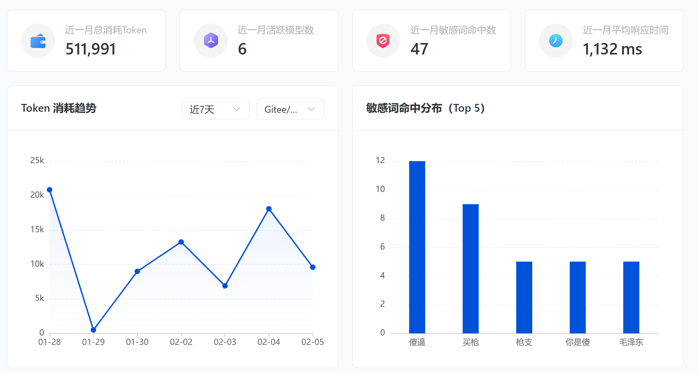
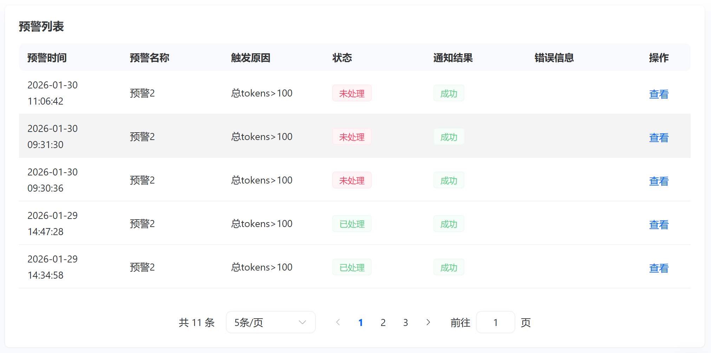
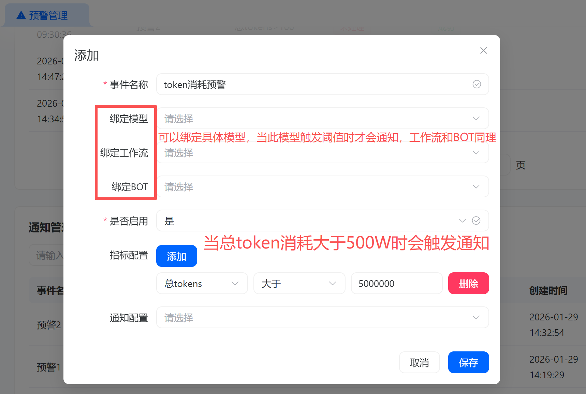
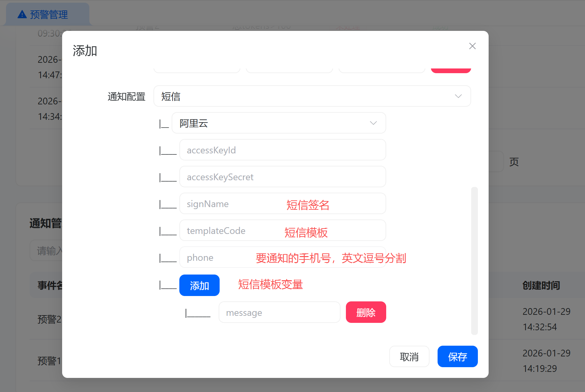
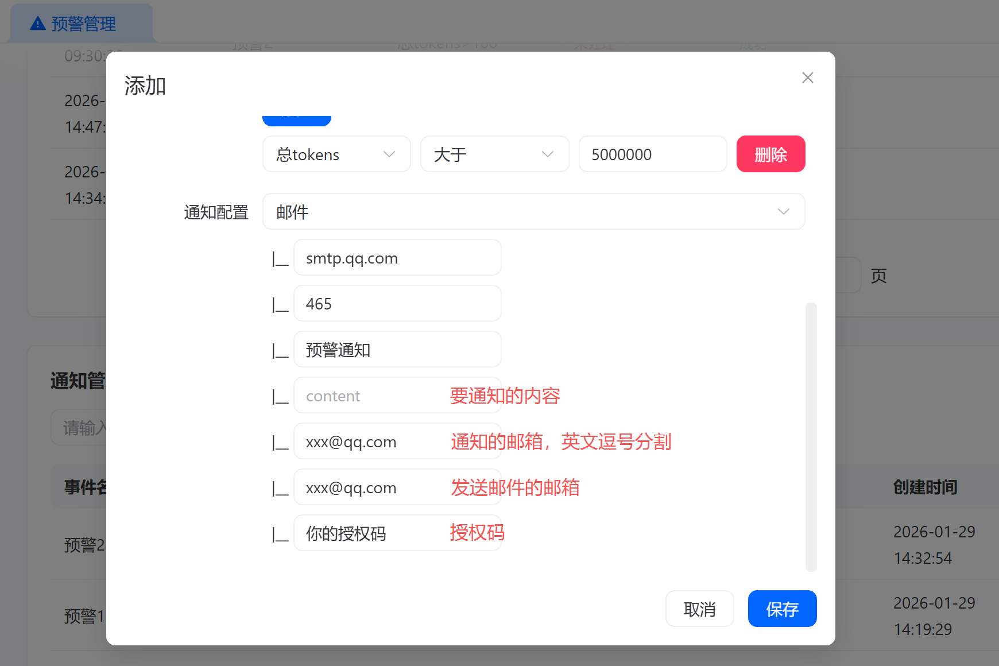

# 预警管理

## 数据统计

统计了近一月消耗的token，使用到的模型数量，敏感词命中次数，大模型请求的平均响应时间等指标。

还有 token 消耗趋势统计，敏感词命中 top 统计。

## 预警列表

当触发某个预警规则时，会发出预警通知并记录在预警列表中。

## 通知管理

可以配置预警规则和通知方式，当触发预警规则时，会根据配置的通知方式发送通知。
通知方式目前支持短信和邮件。

### 预警规则配置

目前支持 token 消耗指标，多个指标满足任意一个，就会触发预警。

### 短信通知配置

以阿里云为例，腾讯云同理：

### 邮件通知配置

以 QQ 邮箱为例：

