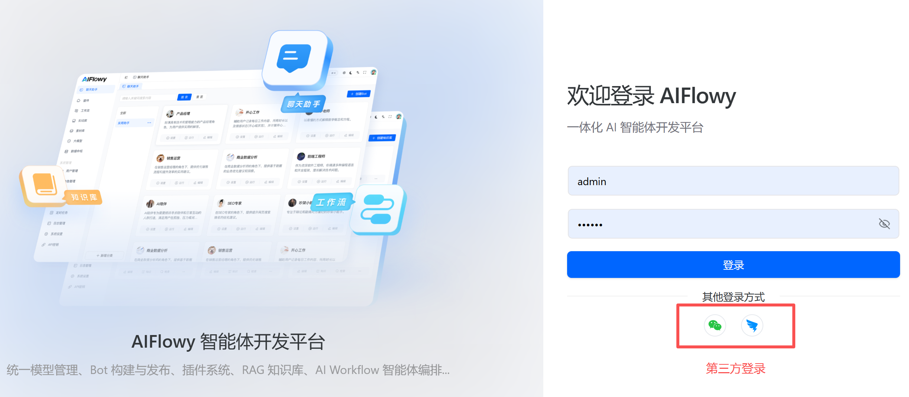
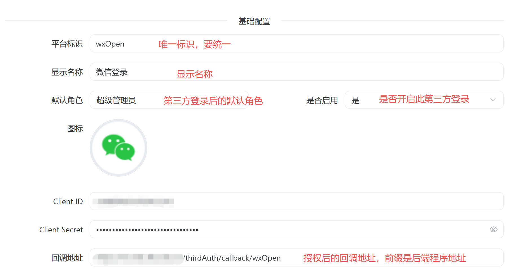
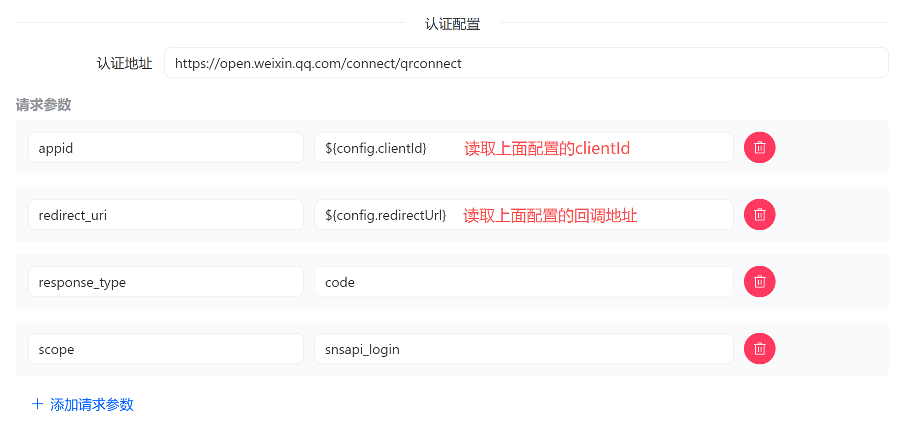
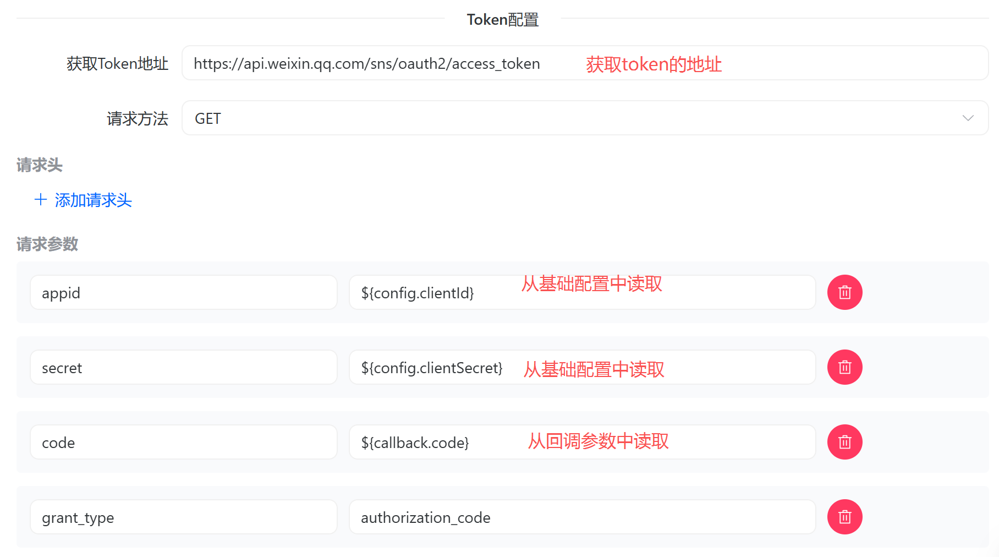
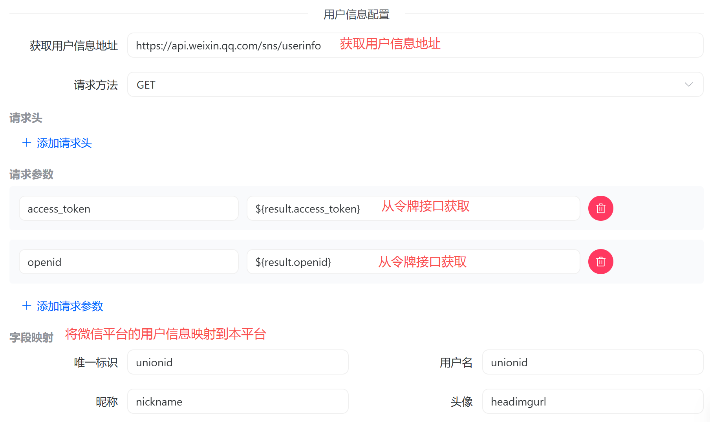

# 认证设置

## 简介

认证设置是系统中的一个核心功能模块，用于管理和配置第三方 OAuth 登录平台。
支持灵活配置各种 OAuth 提供商(如微信、GitHub、钉钉等)，通过可视化界面完成 OAuth 授权流程的各项参数配置。



## 功能特性

### 1. 基础信息配置
- **平台标识**: 配置 OAuth 平台的唯一标识符(如 `wxOpen`)
- **显示名称**: 设置平台在前端的显示名称(如"微信登录")
- **角色绑定**: 为 OAuth 登录用户分配默认角色
- **启用状态**: 控制该 OAuth 登录方式的开启/关闭
- **平台图标**: 上传和展示 OAuth 平台的图标

### 2. OAuth 客户端配置
- **Client ID**: OAuth 客户端标识符
- **Client Secret**: OAuth 客户端密钥(支持密码显示/隐藏)
- **回调地址**: OAuth 授权成功后的回调 URL

### 3. 授权 URL 配置
- **授权端点**: 配置 OAuth 授权请求的 URL 地址
- **动态参数**: 支持自定义授权请求参数(key-value 形式)

### 4. 令牌(Token)配置
- **令牌端点**: 配置获取访问令牌的 URL 地址
- **请求方法**: 支持 GET/POST 两种 HTTP 方法
- **请求头配置**: 动态添加 HTTP 请求头
- **请求参数配置**: 动态配置请求参数

### 5. 用户信息配置
- **用户信息端点**: 配置获取用户信息的 URL 地址
- **请求方法**: 支持 GET/POST 两种 HTTP 方法
- **请求头配置**: 动态添加 HTTP 请求头
- **请求参数配置**: 动态配置请求参数
- **字段映射**: 将第三方用户信息映射到系统用户字段

## 配置示例

### 配置微信开放平台登录

#### 基础配置

回调地址 URI: `https://后台接口域名/thirdAuth/callback/wxOpen`


#### 授权地址配置

$\{config.clientId\}：动态参数，从基础配置中获取。

$\{config.clientSecret\}：动态参数，从基础配置中获取。



#### 获取令牌配置

$\{callback.code\}：动态参数，从回调参数中获取。



#### 获取用户信息配置


#### 示例 JSON

```json
{
  "id": "unique-id",
  "platform": "wxOpen",
  "displayName": "微信登录",
  "icon": "",
  "clientId": "xxx",
  "clientSecret": "xxx",
  "redirectUrl": "https://yourdomain.com/thirdAuth/callback/wxOpen",
  "authUrl": "https://open.weixin.qq.com/connect/qrconnect",
  "authHttpConfig": {
    "params": {
      "appid": "${config.clientId}",
      "redirect_uri": "${config.redirectUrl}",
      "response_type": "code",
      "scope": "snsapi_login"
    }
  },
  "tokenUrl": "https://api.weixin.qq.com/sns/oauth2/access_token",
  "tokenHttpConfig": {
    "method": "get",
    "headers": {},
    "params": {
      "appid": "${config.clientId}",
      "secret": "${config.clientSecret}",
      "code": "${callback.code}",
      "grant_type": "authorization_code"
    }
  },
  "userInfoUrl": "https://api.weixin.qq.com/sns/userinfo",
  "userInfoHttpConfig": {
    "method": "get",
    "params": {
      "access_token": "${result.access_token}",
      "openid": "${result.openid}"
    },
    "fieldMapping": {
      "userKey": "unionid",
      "username": "unionid",
      "nickname": "nickname",
      "avatar": "headimgurl"
    }
  },
  "enabled": 1,
  "roleId": "366317572540592121"
}
```


## 功能详解

### 动态请求头配置 (DynamicHeaders)
支持动态添加、删除 HTTP 请求头,每个请求头包含:
- **Header Key**: 请求头名称
- **Header Value**: 请求头值
- 删除按钮: 移除不需要的请求头

### 动态参数配置 (DynamicParams)
支持动态添加、删除请求参数,每个参数包含:
- **Param Key**: 参数名称
- **Param Value**: 参数值
- 删除按钮: 移除不需要的参数

### 字段映射 (FieldMapping)
将第三方 OAuth 返回的用户信息字段映射到系统标准字段:
- **userKey**: 用户唯一标识(如 `unionid`, `id`)
- **username**: 用户名(如 `unionid`, `login`)
- **nickname**: 昵称(如 `nickname`, `name`)
- **avatar**: 头像地址(如 `headimgurl`, `avatar_url`)

## 常见问题

### Q1: 如何获取 OAuth 平台的 Client ID 和 Secret?
A: 需要在对应的 OAuth 提供商开放平台(如微信开放平台、GitHub OAuth Apps)注册应用,申请获取。

### Q2: 请求方法(GET/POST)如何选择?
A: 根据 OAuth 提供商的 API 文档要求选择,大多数令牌请求使用 POST,用户信息请求使用 GET。

### Q3: 字段映射的作用是什么?
A: 将不同 OAuth 提供商返回的用户信息字段统一映射到系统的标准字段,确保数据格式一致。

### Q4: 配置后立即生效吗?
A: 配置保存后即可生效,建议在配置完成后使用测试账号进行登录验证。

