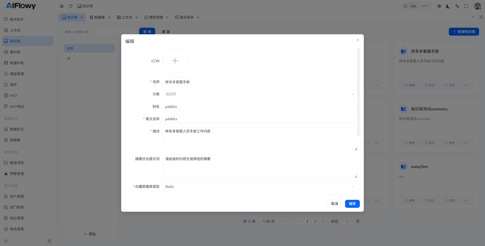
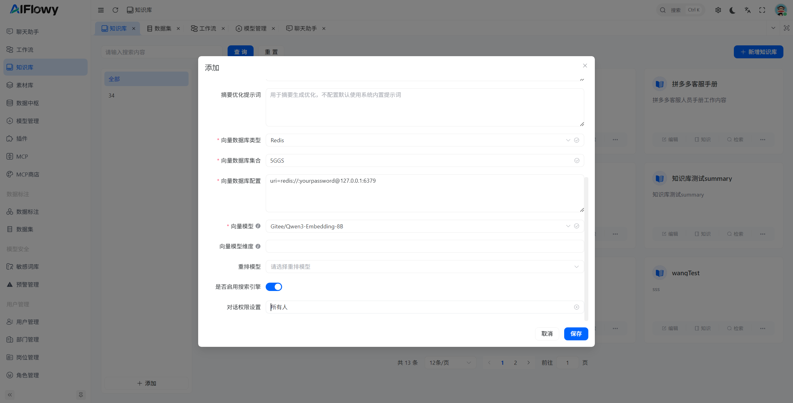
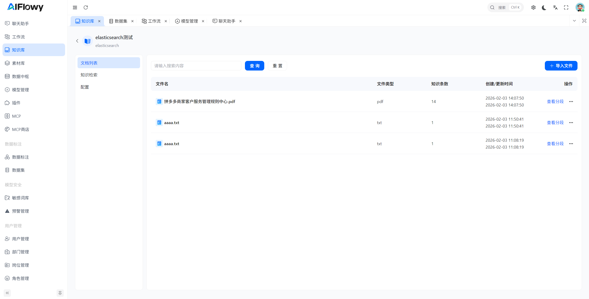
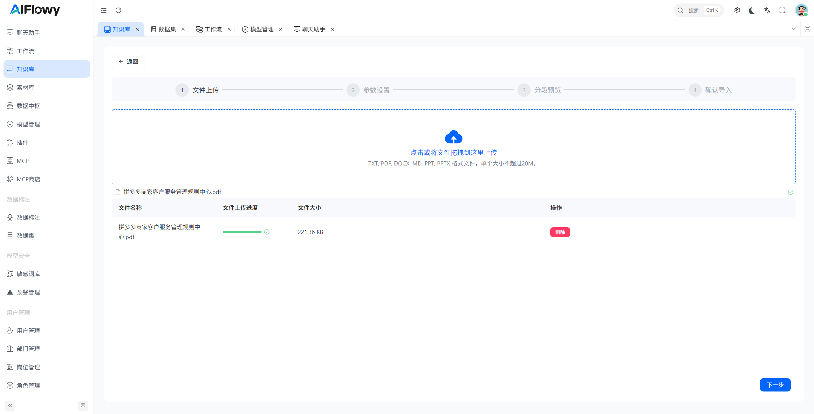
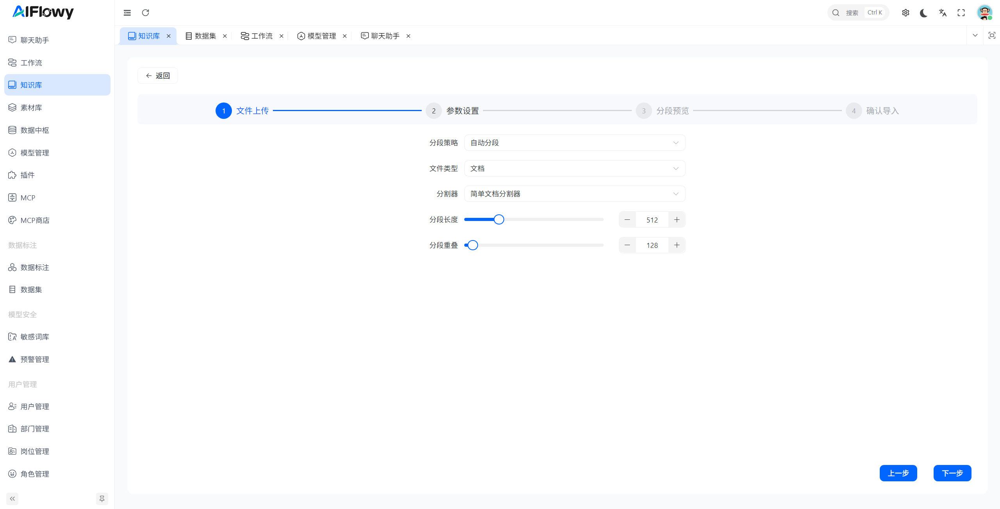
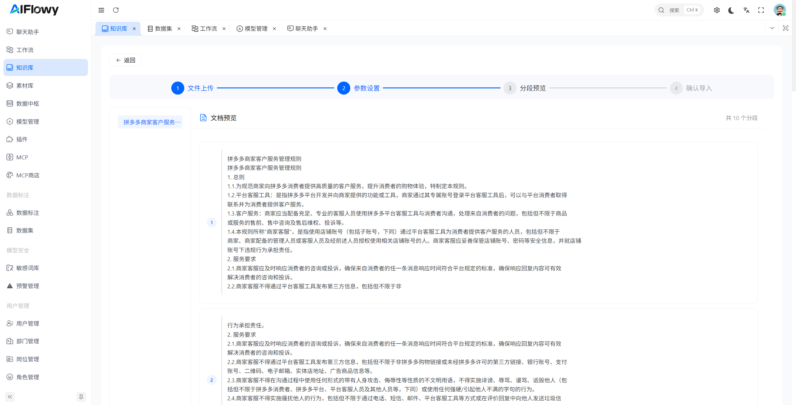
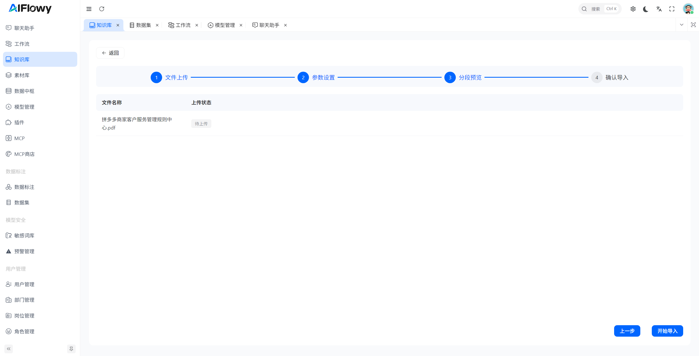

# 如何创建一个知识库

这里以向量数据库 **redis-stack** 为例，创建知识库的时候需要注意以下几点：
1. **知识库名称**：知识库的名称非常重要，所以请确保名称不重复。知识库名称需要让大模型识别，大模型会判断该知识库的名称，从而进行知识库的检索。
2. **知识库描述**：知识库的描述是可选的，但是建议添加描述，方便用户了解知识库的内容。

## 1. 创建向量模型
请参考 [如何创建向量模型](/zh/product/knowledge/embedding)

## 2. 创建知识库

## 3. 知识库导入文档
1. 点击 **知识**，进入 **文档列表** 页面

2. 点击右上角 **导入文件** 按钮， 进入知识导入页面
3. 如图，上传符合要求的文档格式文件

4. 上传成功之后，点击右下角的 **下一步** 按钮, 进入参数设置页面， 这里可以设置不同的分割器对文档进行分割，默认使用 **简单文档分割器**

5. 参数设置完成之后点击右下角的 **下一步** 按钮，进入文档预览页面，当前预览的文档就是将要存入数据库的文档

6. 文档预览完成之后点击 **下一步** 按钮，进入文档导入页面

7. 点击 **开始导入** 按钮，开始导入文档