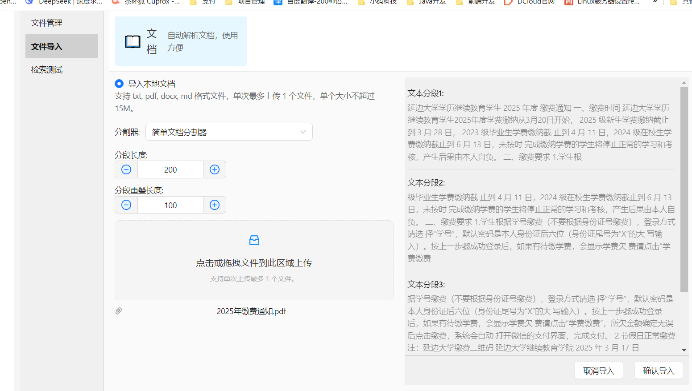
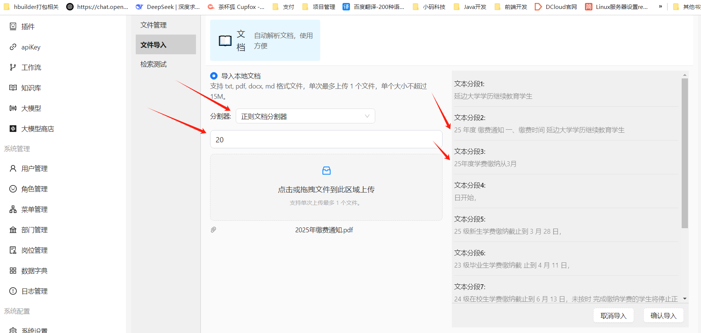
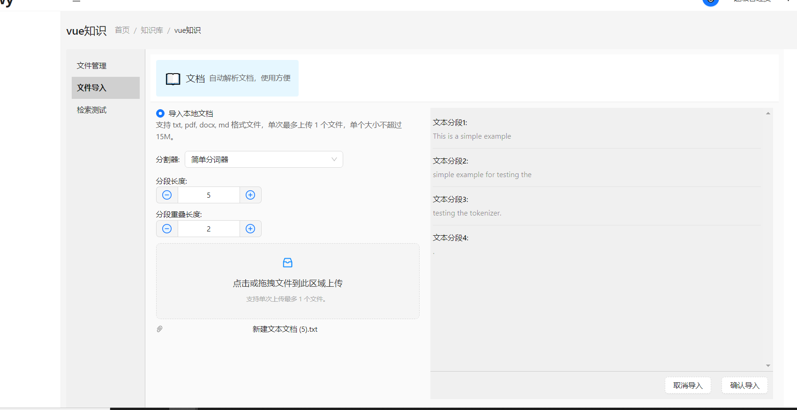

# 快速开始

## 创建知识库

1、创建知识库并且配置向量数据库，Embedding 模型，这里使用 redis-stack 向量数据库，然后保存

2、进入知识库

## 创建知识库文档

1、选择文件导入菜单，先选择文档分割器，设置文档分割长度，然后选择文件后预览分割效果，最后点击确认导入就能将文档导入知识库了

2、点击**文件管理**， 可以看到导入的文档，点击**查看**按钮，就可以看到文档内容了

3、点击查看，可以看到文档分割的段落

## 文档分割器

在 AIFlowy 中，文档分割器是一个用于将长文本分割为 smaller chunks 的组件。

文档分割器有三种：

1、**简单文档分割器：** 按照段落分割，指定段落长度，默认为 200 字， 指定分段重叠长度，默认为 100 字

**分割示例：**

2、**正则表达式分割器：** 使用正则表达式对文本进行分割，支持自定义正则表达式

**分割示例：**

3、**简单分词器：**

这个分词器的核心是将文本先转换为一系列 token （语义单元），然后根据设定的 chunkSize 和 overlapSize 来分割这些 token，最后再将分割后的 token 转换回文本。

**分割示例：**

## 文件检索

1、点击**检索测试**，输入想要检索的关键字，可以看到检索结果及返回的相似度

