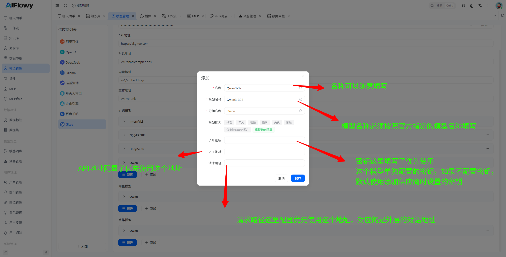

# 模型管理

## 模型列表
通过侧边栏的 **模型管理** 菜单项进入模型列表


在这个页面对大模型进行搜索、新增、修改、删除等操作。

## 添加模型
这里做添加对话模型的示例：点击对话模型这块对应的添加按钮



## 使用对话模型必知
我们添加模型的时候有一个**模型能力**标签的选择，其中有一个**支持Tool消息**，这个标签是必选的，这个标签是表示这个模型是否支持Tool消息，这个标签是必选的，这个标签是表示这个模型是否支持Tool消息。<br/>
**Agentsflex中对该参数的转换逻辑为：**
```java
    protected void buildToolMessageObject(Map<String, Object> objectMap, ToolMessage message, ChatConfig config) {
        if (config.isSupportToolMessage()) {
            objectMap.put("role", "tool");
            objectMap.put("content", message.getTextContent());
            objectMap.put("tool_call_id", message.getToolCallId());
        }
        // 部分模型（如 DeepSeek V3）不支持原生 tool message 格式，
        // 此处将 tool message 转换为 system message 格式以确保兼容性
        else {
            objectMap.put("role", "system");
            Map<String, Object> contentMap = new LinkedHashMap<>();
            contentMap.put("tool_call_id", message.getToolCallId());
            contentMap.put("content", message.getTextContent());
            objectMap.put("content", JSON.toJSONString(contentMap));
        }
    }
```
**支持Tool消息，标签勾选发送的消息示例为：** 其中影响的是提交function call 内容的消息的**role**，勾选上时，发送的消息role为tool，否则为system。
```JSOn
{
  "top_p": 0.7,
  "stream": true,
  "max_tokens": 2048,
  "temperature": 0.7,
  "messages": [
    {
      "content": "你是一个AI助手，请根据用户的问题给出清晰、准确的回答。",
      "role": "system"
    },
    {
      "content": "查询北京今天的天气",
      "role": "user"
    },
    {
      "content": "",
      "tool_calls": [
        {
          "function": {
            "name": "query_weather",
            "arguments": "{\"city\": \"北京\", \"date\": \"今天\"}"
          },
          "id": "chatcmpl-tool-0eba1ce1b60f480ab83db53b9083d5fe",
          "type": "function"
        }
      ],
      "role": "assistant"
    },
    {
      "content": "北京今日天气：晴，气温5~18℃，东北风2级，空气质量良（AQI 65），适宜户外活动。",
      "role": "tool",
      "tool_call_id": "chatcmpl-tool-0eba1ce1b60f480ab83db53b9083d5fe"
    }
  ],
  "model": "Qwen3-32B",
  "stream_options": {
    "include_usage": true
  },
  "tools": [
    {
      "function": {
        "name": "query_weather",
        "description": "查询指定城市指定日期的天气信息（支持今日、明日、未来7天）",
        "parameters": {
          "type": "object",
          "properties": {
            "city": {
              "description": "要查询的城市名称（如北京、上海）",
              "type": "string"
            },
            "date": {
              "description": "查询日期（支持今日、明日、未来7天）",
              "type": "string"
            }
          },
          "required": ["city", "date"]
        }
      },
      "type": "function"
    }
  ]
}
```
**支持Tool消息，标签不勾选发送的消息示例为：**

```JSON
{
  "top_p": 0.7,
  "stream": true,
  "max_tokens": 2048,
  "temperature": 0.7,
  "messages": [
    {
      "content": "你是一个AI助手，请根据用户的问题给出清晰、准确的回答。",
      "role": "system"
    },
    {
      "content": "查询广州未来7天的天气",
      "role": "user"
    },
    {
      "content": "[{\"function\":{\"name\":\"query_weather\",\"arguments\":\"{\\\"city\\\": \\\"广州\\\", \\\"date\\\": \\\"未来7天\\\"}\"},\"id\":\"chatcmpl-tool-00e619c4207d4ce58256c6672e7ba134\",\"type\":\"function\"}]",
      "role": "system"
    },
    {
      "content": "{\"tool_call_id\":\"chatcmpl-tool-00e619c4207d4ce58256c6672e7ba134\",\"content\":\"广州未来7天天气预告：\\nDay1（今日）：晴，15~26℃，南风2级，AQI 58（良）；\\nDay2（明日）：多云转晴，16~27℃，东南风3级，AQI 62（良）；\\nDay3：小雨，14~22℃，东北风4级，AQI 45（优）；\\nDay4：小雨转多云，13~20℃，东风3级，AQI 51（良）；\\nDay5：晴，15~24℃，南风2级，AQI 48（优）；\\nDay6：晴转多云，16~25℃，西南风3级，AQI 60（良）；\\nDay7：多云，17~26℃，西北风2级，AQI 55（良）；\\n温馨提示：未来7天有2天降雨，出行请携带雨具，注意温差变化。\"}",
      "role": "system"
    }
  ],
  "model": "Qwen3-32B",
  "stream_options": {
    "include_usage": true
  },
  "tools": [
    {
      "function": {
        "name": "query_weather",
        "description": "查询指定城市指定日期的天气信息，支持今日、明日、未来7天查询",
        "parameters": {
          "type": "object",
          "properties": {
            "city": {
              "description": "查询的城市名称（如广州、深圳、成都）",
              "type": "string"
            },
            "date": {
              "description": "查询的日期范围（支持今日、明日、未来7天）",
              "type": "string"
            }
          },
          "required": ["city", "date"]
        }
      },
      "type": "function"
    }
  ]
}
```