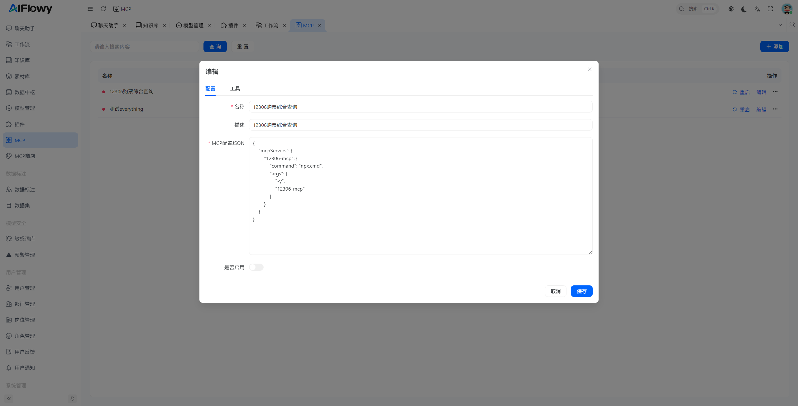
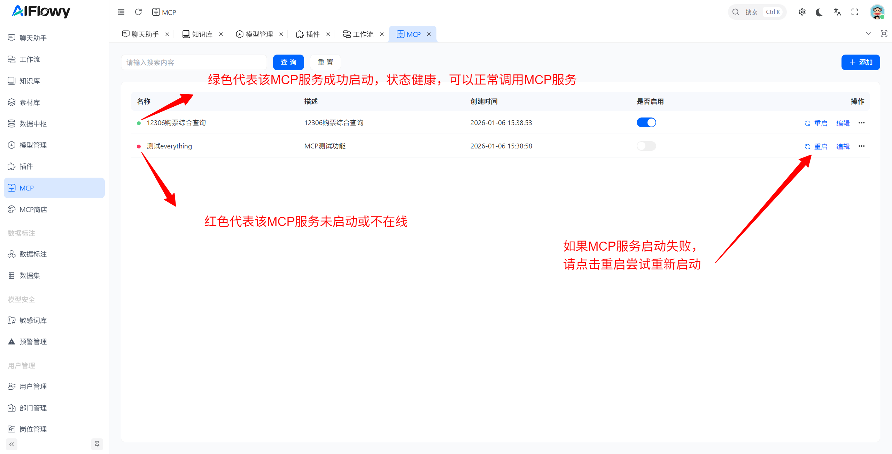
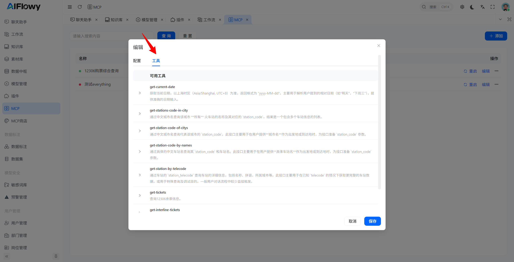

# MCP
注意：启动MCP需要机器上安装node.js环境，并且需要配置环境变量，node，npm，npx ，否则启动MCP会失败
下面这个是假如你在宝塔成功安装了node.js环境，并且版本是**v24.11.1**，那么下面这些命令应该可以成功执行
```text
# 1. 给node创建全局软链接
ln -sf /www/server/nodejs/v24.11.1/bin/node /usr/bin/node
# 2. 给npm创建全局软链接
ln -sf /www/server/nodejs/v24.11.1/bin/npm /usr/bin/npm
# 3. 给npx创建全局软链接
ln -sf /www/server/nodejs/v24.11.1/bin/npx /usr/bin/npx
# 4. 赋予所有可执行权限，避免权限不足
chmod +x /usr/bin/node /usr/bin/npm /usr/bin/npx
# 5. 立即验证三个命令（核心：都要输出版本号）
node -v && npm -v && npx -v
```
1. 如图，我建立了一个**12306购票综合查询**的MCP服务


2. **12306购票综合查询** 配置JSON示例如下：
```JSON
{
    "mcpServers": {
        "12306-mcp": {
            "command": "npx.cmd",
            "args": [
                "-y",
                "12306-mcp"
            ]
        }
    }
}
```
3. 启动MCP服务


4. 点击**编辑**按钮，点击 **工具** 栏菜单，可以查看到我们启动的MCP服务有哪些工具可以调用


