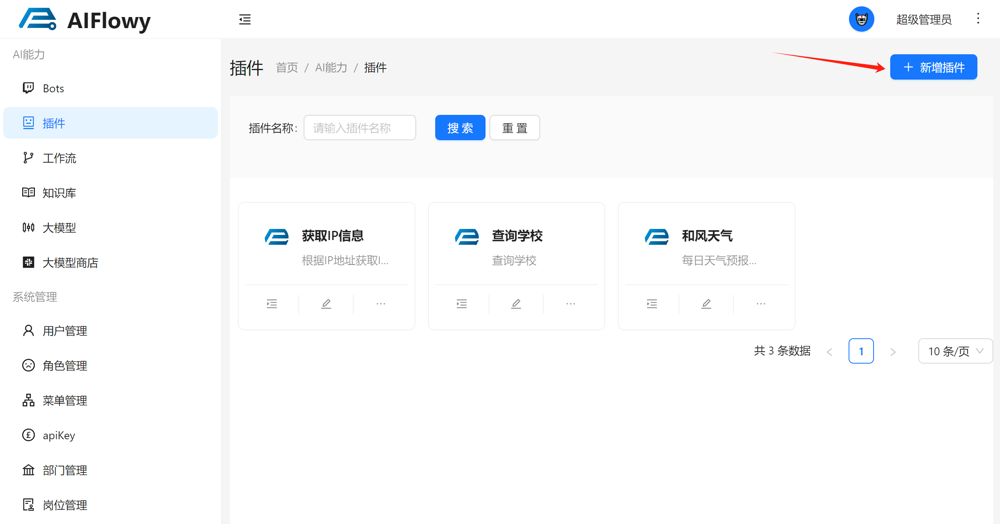
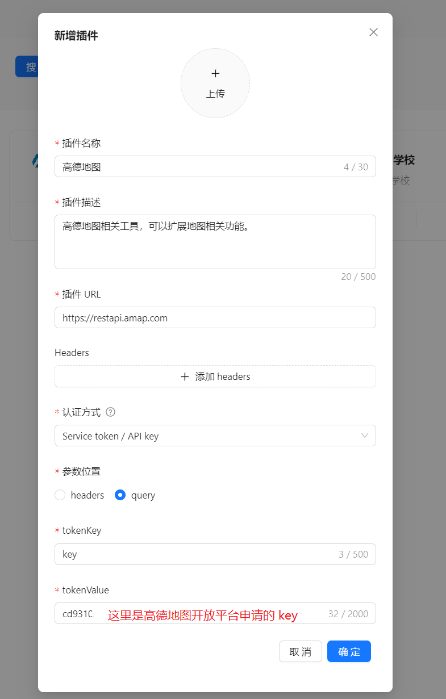
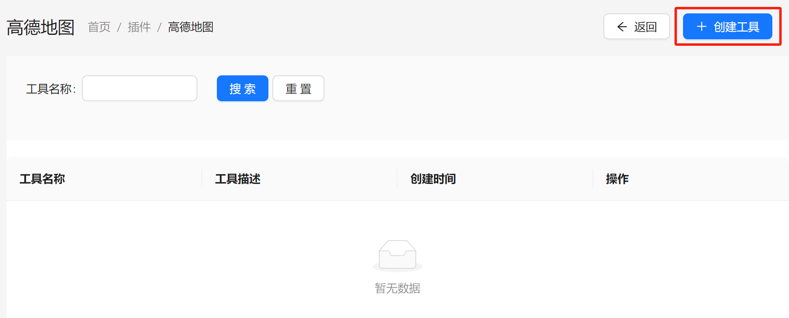
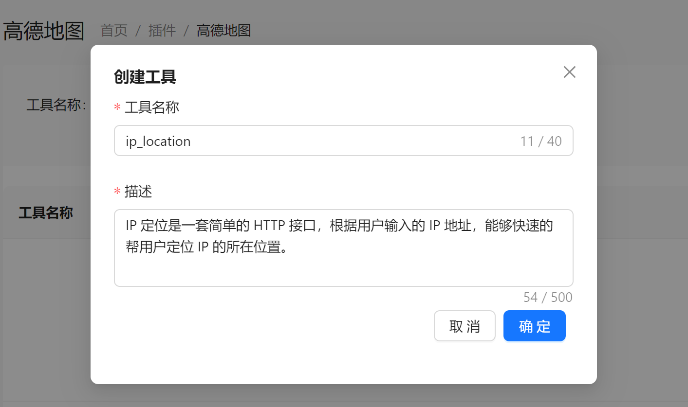
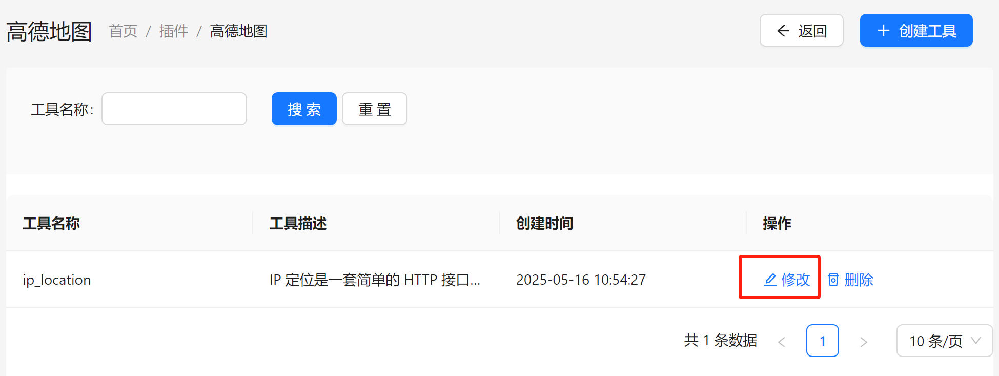
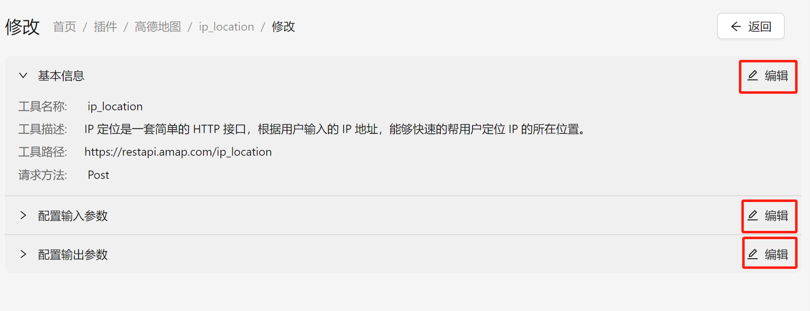
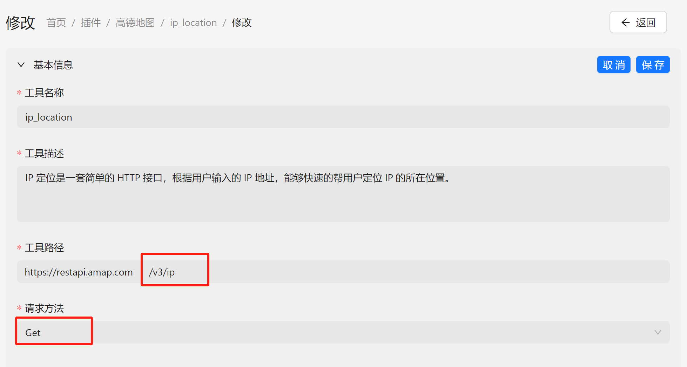
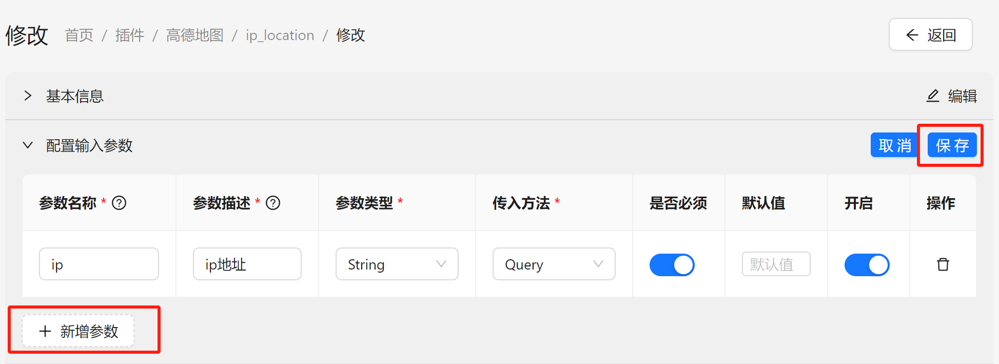
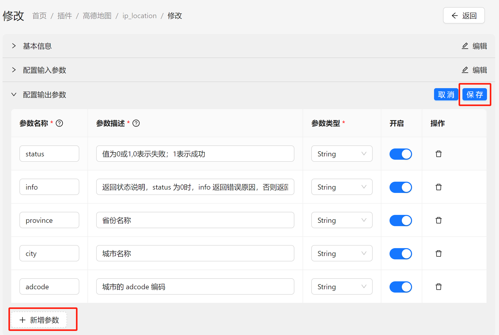

# 快速开始

## 添加 HTTP 插件

我们以添加 `高德地图` 插件为例，演示一下如何添加插件。

点击添加插件按钮：

会弹出新增弹框：

- 插件名称：插件的名称。
- 插件描述：插件可以实现一些什么样的功能。
- 插件 URL：插件的请求地址，当前插件下的所有工具都是基于这个请求地址。
- Headers： 请求头，该插件所需的请求头参数。
- 认证方式：
  选择插件使用的授权或验证方式。目前支持如下两种类型：
  - 无需认证
不需要认证，直接访问插件即可。
  - Service token / API key
  Token（令牌）是一种身份验证方式，用户或系统需提供唯一的密钥（Token）来访问受保护的资源。插件校验 Token 合法后，允许操作。

添加完毕后，点击工具列表按钮：

来到工具列表页面后，点击创建工具按钮：

填写相关信息后点击确定按钮保存：

之后工具列表里就会出现刚才添加的工具，我们点击修改，进一步完善工具信息：

来到工具详情页，我们需要完善三个地方的信息：

修改基本信息，主要是修改工具路径和请求方法：

> 记得点击保存

配置输入参数信息：

> 记得点击保存

配置输出参数（这里仅配置了部分参数，方便演示）：

> 记得点击保存

全部配置保存之后，工具就添加成功了。

## 添加本地插件

> 规划中...