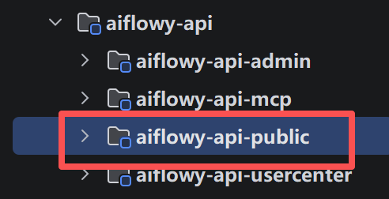
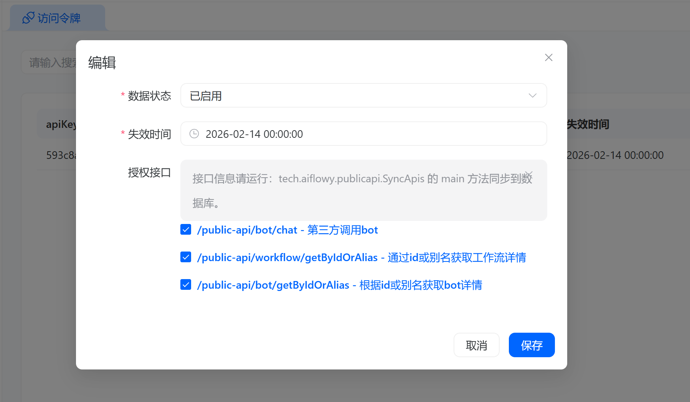

# 访问令牌

可通过访问令牌来访问 Aiflowy 平台的 API，方便在自定义应用中集成 Aiflowy 平台的功能。

接口统一放在 `aiflowy-api-public` 模块中。

## 创建令牌并授权

创建令牌后，可为当前令牌添加接口权限。

## 自定义接口
如现有接口无法满足业务需求，可在 `aiflowy-api-public` 模块中添加自定义接口。

接口添加完毕后，运行 `tech.aiflowy.publicapi.SyncApis` 类，将接口信息同步到数据库中。

在后台管理页面中对应的 api key 记录勾选新增加的接口即可。