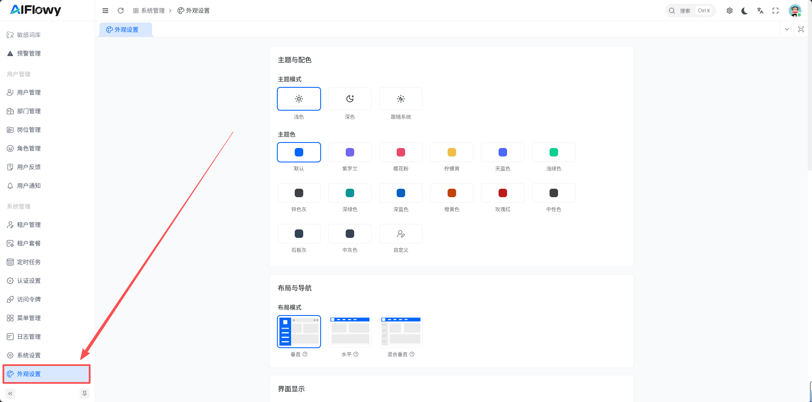

# 外观设置

## 一、概述

外观设置模块允许系统管理员自定义系统界面的视觉风格、布局以及登录页的外观。通过本模块，您可以调整主题配色、界面布局、页面标签页行为、登录页样式等，以适应不同用户偏好或企业品牌形象。

## 二、进入外观设置

1. 登录 AIFlowy 系统。
2. 在左侧菜单栏中找到并点击 **系统管理 -> 外观设置**。

## 三、功能说明

### 1. 主题与配色

| 设置项 | 选项 | 说明 |
|--------|------|------|
| 主题模式 | 浅色、深色、跟随系统 | 设置系统整体主题风格 |
| 主题色 | 默认、紫罗兰、樱花粉、柠檬黄、天蓝色、浅绿色、锌色灰、深绿色、深蓝色、橙黄色、玫瑰红、石板灰、中灰色、自定义 | 选择系统主色调 |

### 2. 布局与导航

| 设置项 | 选项 | 说明 |
|--------|------|------|
| 布局模式 | 垂直、水平、混合垂直 | 设置系统导航菜单的布局方式 |

### 3. 界面显示

#### 页面标签页设置
- **启用标签栏**：是否在顶部显示页面标签栏
- **启动拖拽排序**：允许通过拖拽调整标签顺序
- **显示标签栏图标**：是否在标签上显示页面图标
- **最大标签数**：设置最多可同时打开的标签数量

### 4. 动画设置
- **页面切换进度条**：切换页面时显示加载进度条
- **页面切换 Loading**：切换页面时显示加载动画
- **页面切换动画**：启用页面切换时的过渡动画效果

### 5. 登录页外观

#### 登录页布局
- **居左、居中、居右**：设置登录表单的对齐方式

#### Logo 设置
- **浅色 Logo**：上传适用于浅色背景的 Logo 图片
- **深色 Logo**：上传适用于深色背景的 Logo 图片
- **缩略图**：上传 Logo 小图标版本

#### 登录页图片
- 支持上传 JPG 格式的背景图片

#### 登录页品牌文案
- **欢迎语标题**：自定义登录页欢迎标题
- **欢迎语描述**：自定义登录页欢迎语描述
- **Slogan 标题**：自定义品牌口号标题
- **Slogan 描述**：自定义品牌口号描述

> 注：
> 1. 修改完成后未点击保存只在本地生效
> 2. 用户中心优先使用用户自定义的外观设置