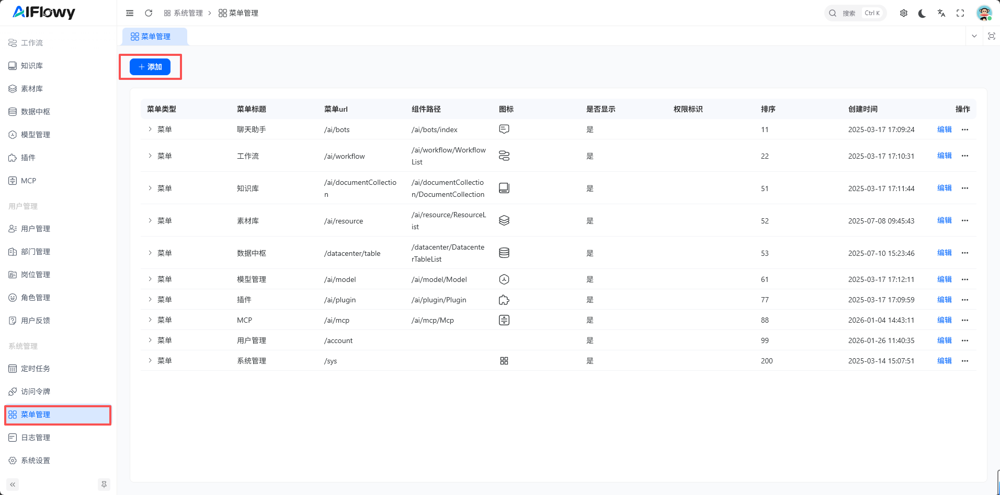
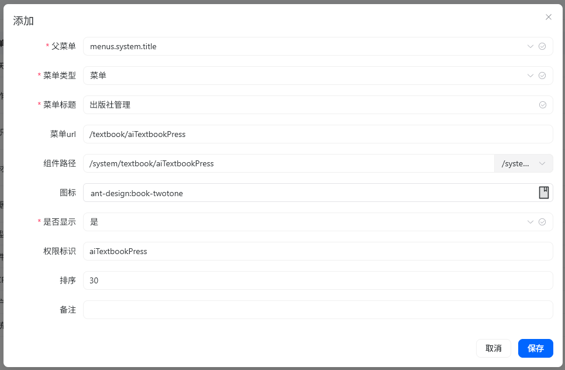

# 菜单管理

## 菜单管理功能

### 菜单层级结构
支持树形层级管理，可创建目录（一级菜单）、子菜单（页面）和按钮（操作权限），形成多级导航结构。

- **目录**：作为顶层分类（如“系统管理”），通常对应导航栏的一级菜单。
- **菜单**：对应具体功能页面（如“用户管理”），需绑定前端路由路径以及页面组件路径。
- **按钮**：控制页面内操作权限（如“新增用户”“删除用户”），需绑定后端接口权限标识。
###  基础配置项

每个菜单可配置以下属性：
- 父菜单（无上级菜单选择顶层，有上级菜单侧选择对应父级菜单标题）。
- 菜单类型
- 菜单标题（可对应国际化key属性，例如：menus.title）、图标。
- 菜单url
- 页面组件路径
- 权限标识（如 `system:user:list`，用于接口鉴权）
- 显示顺序（控制菜单排序）是否显示（如某些管理页需动态显示）

### 动态权限控制

菜单与角色关联，不同角色登录后仅能看到被授权的菜单，实现**按角色动态渲染导航栏**。

## 操作流程

### 创建菜单
- 在系统管理的“菜单管理”界面，通过“添加”按钮添加目录、菜单或按钮。

- 填写路由、组件、权限标识等关键信息，并设置父级菜单以形成层级关系

### 关联角色权限
进入“角色管理”，为角色[分配](role.md)可访问的菜单和按钮权限。

### 前端动态加载
- 前端根据菜单数据动态生成路由和侧边栏导航，隐藏无权限项。
