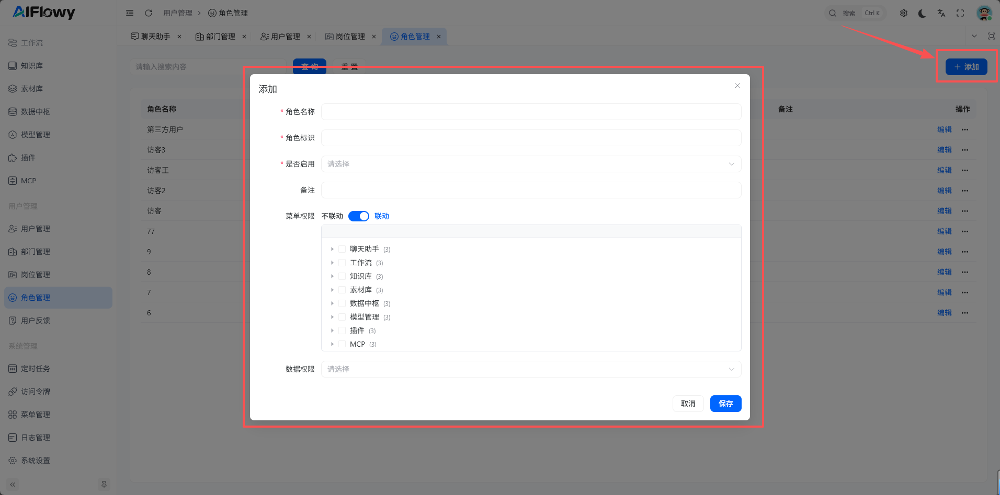
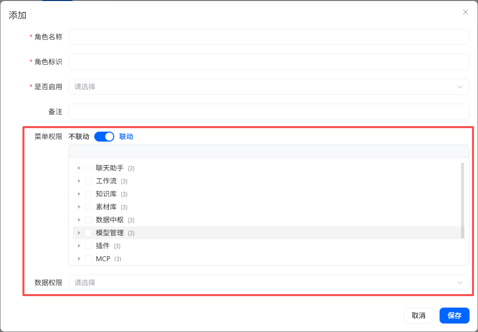

# 角色管理
AiFlowy 基于 RBAC 进行权限划分 ，角色是权限的集合，拥有指定权限，才可以访问指定的路由、按钮。

从侧边栏点击`角色管理`进入角色管理界面。

## 新增角色
点击添加按钮，弹出添加角色弹窗，填充信息点击保存后新增角色。

## 权限分配
非超级管理员的角色可以分配权限，超级管理员拥有所有权限。勾选要分配的权限点击确认，完成权限分配。

至此，拥有该角色的用户就具备了访问该角色下路由、按钮的权限。

