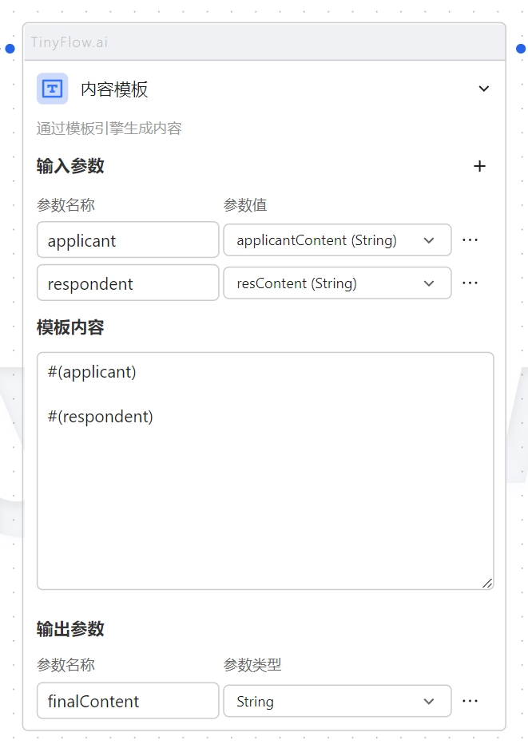

# 内容模板

使用 Enjoy Template Engine 模板引擎，上手简单。



以下是一些常用方法，如需更多使用方法，请查看 [Enjoy Template Engine 文档](https://jfinal.com/doc/6-1)

## 表达式

- 算术运算： +   -   *   /   %   ++   --
- 比较运算： >  >=   <   <=  ==   !=
- 逻辑运算： !   &&   ||
- 三元表达式： ? :
- Null 值常量: null
- 字符串常量： "abc"
- 布尔常量：true false
- 数字常量： 123  456F  789L  0.1D  0.2E10
- 数组存取：array[i]
- 属性取值：object.field
- 方法调用：object.method(p1, p2…, pn)
- 逗号表达式：123, 1>2, null, "abc", 3+6 

## 方法调用
```
// 调用了String对象上的substring(0, 3)方法输出值为 "ABC"
#("ABCDE".substring(0, 3))
// girl对象拥有getAge()方法时可调用
#(girl.getAge())
// list对象的size()方法
#(list.size())
// Map类型时可调用其 get(...) 方法
#(map.get(key))
```

## 指令

### #() 输出指令

#(…) 输出指令的使用极为简单，只需要为该指令传入前面6.4节中介绍的任何表达式即可，指令会将这些表达式的求值结果进行输出，特别注意，当表达式的值为 null 时没有任何输出，更不会报异常。

```
#(value)
#(object.field)
#(object.field ??)
#(a > b ? x : y)
```

### #if 指令

```
#if(c1)
  ...
#else if(c2)
  ...
#else if (c3)
  ...
#else
  ...
#end
```

### #for 指令

```
// 对 List、数组、Set 这类结构进行迭代
#for(x : list)
  #(x.field)
#end
 
// 对 Map 进行迭代
#for(x : map)
  #(x.key)
  #(x.value)
#end
```

### #switch 指令
```
#switch (month)
  #case (1, 3, 5, 7, 8, 10, 12)
    #(month) 月有 31 天
  #case (2)
    #(month) 月平年有28天，闰年有29天
  #default
    月份错误: #(month ?? "null")
#end
```

### #set 指令
```
#set(x = 123)
#set(a = 1, b = 2, c = a + b)
#set(array[0] = 123)
#set(map["key"] = 456)
 
#(x)  #(c)  #(array[0])  #(map.key)  #(map["key"])
```


